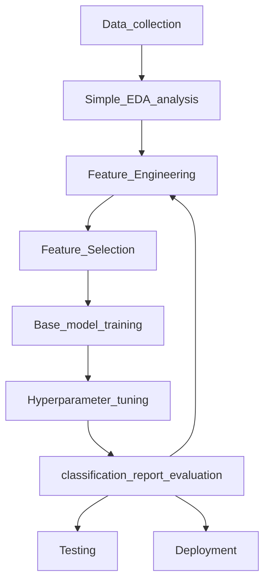

# Thyroid-disease-detection

What is the thyroid?
The thyroid gland is a small organ that’s located in the front of the neck, wrapped around the windpipe (trachea). It’s shaped like a butterfly, smaller in the middle with two wide wings that extend around the side of your throat. The thyroid is a gland. You have glands throughout your body, where they create and release substances that help your body do a specific thing. Your thyroid makes hormones that help control many vital functions of your body.

## About dataset:
Latest veersion of thyriod dataset is collected from the UCI archive and performed the Machine learning architectures to build the prediction on preprocessed dataset
and the rchive of thyroid diagnoses obtained from the Garvan Institute, consisting of 9172 records from 1984 to early 1987.

Link for dataset: https://archive.ics.uci.edu/ml/datasets/thyroid+disease

## Approach and ML architecture:

For the given problem datase,as targets are labeled with independent variable considered under supervised learning and decided to apply classification supervised model
on given dataset.Our dataset is belong to multiclass classification model and consists around 20 class of Diagnosis belongs to 7 conditions[hyperthyroid conditions,hypothyroid conditions,binding protein,general health,replacement therapy,antithyroid treatment,miscellaneous].

## ML Architecture:

## Tech Stack used:

### * Pandas          
### * Streamlit 
### * Sklearn
        
## Deployment:
For frontend and depolyment streamlit is considered as framework for this work as it helpfull in easy user interface development and deployment in streamlit cloud
In framework considered only importent features based on model results [below figure],out of 30 features 11 features are considered as important.

Webapp link: https://sabhapathi0306-thyroid-disease-detection-thy-0m9u53.streamlitapp.com/
          
